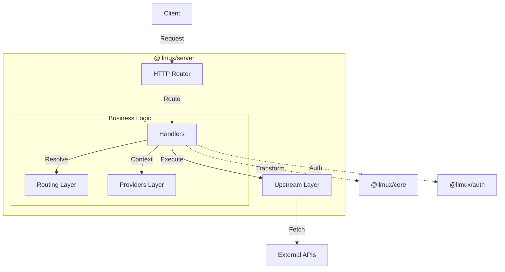

# llmux

**Bidirectional LLM API Proxy & Transformation Library**

llmux is a TypeScript SDK and Proxy Server that enables seamless bidirectional transformation of requests and responses between multiple AI providers (OpenAI, Anthropic, Gemini, Antigravity, etc.).

It acts as a universal adapter, allowing clients written for one provider (e.g., OpenAI SDK) to communicate with any other supported provider by translating formats on the fly.

## 🚀 Key Features

- **Universal Transformation**: Bidirectional conversion between OpenAI, Anthropic, Gemini, and more.
- **Layered Architecture**: Clean separation of HTTP handling, model routing, provider logic, and upstream execution.
- **Advanced Routing**: Intelligent model-to-provider routing with fallback support and cooldown management.
- **Real-time Streaming**: Full SSE (Server-Sent Events) streaming support with unified stream chunks.
- **Authentication**: Built-in support for OAuth (GitHub Copilot, Antigravity), API Keys, and token rotation.
- **Reliability**: Automatic retries, rate-limit handling (429), and account rotation.

## 📦 Packages

| Package | Description |
|---------|-------------|
| [`@llmux/core`](packages/core) | Core SDK implementation, unified types, and transformation logic. |
| [`@llmux/server`](packages/server) | HTTP Proxy Server implementing the layered architecture. |
| [`@llmux/auth`](packages/auth) | Authentication providers, credential storage, and token refresh. |
| [`@llmux/cli`](packages/cli) | CLI tools for server management and authentication. |

## 🏗️ Architecture

The system follows a layered architecture to ensure separation of concerns:



- **Handlers**: Thin wrappers (`proxy`, `streaming`) that coordinate the request flow.
- **Routing**: Centralized logic (`ModelRouter`) to resolve models to providers.
- **Providers**: Provider-specific logic (e.g., Antigravity auth, Codex body building).
- **Upstream**: Standardized endpoint resolution and HTTP execution.

## 🛠️ Installation & Usage

### Prerequisites

- [Bun](https://bun.sh) (Runtime & Package Manager)

### Quick Start

1.  **Install dependencies**:
    ```bash
    bun install
    ```

2.  **Build packages**:
    ```bash
    bun run build
    ```

3.  **Start the server**:
    ```bash
    bun run --filter @llmux/cli serve
    ```

4.  **Authenticate (if needed)**:
    ```bash
    bun run --filter @llmux/cli auth login antigravity
    ```

## 🔌 API Endpoints

The server exposes standard compatible endpoints:

| Endpoint | Compatible SDK | Description |
|----------|----------------|-------------|
| `/v1/chat/completions` | OpenAI | Proxies to target provider via OpenAI format. |
| `/v1/messages` | Anthropic | Proxies to target provider via Anthropic format. |
| `/v1/generateContent` | Gemini | Proxies to target provider via Gemini format. |
| `/v1/proxy` | Universal | Explicit provider routing via headers. |

## 🤝 Supported Providers

- **OpenAI** (GPT-4, GPT-3.5)
- **Anthropic** (Claude 3.5 Sonnet, Opus, Haiku)
- **Google Gemini** (Pro, Flash)
- **Antigravity** (Internal Google Gateway)
- **OpenAI Web** (ChatGPT Backend / Codex)
- **Opencode Zen** (Unified Gateway)

## 📄 License

MIT
