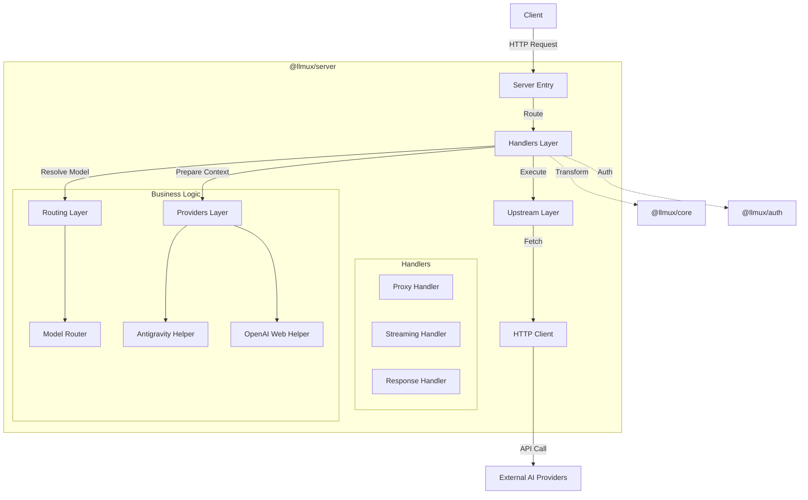

# Architecture

## Overview

llmux uses a layered architecture to ensure modularity, testability, and separation of concerns. The server acts as a proxy that intercepts requests, transforms them using `@llmux/core`, routes them to the appropriate provider, and handles authentication via `@llmux/auth`.

## Diagram

## Layers

### 1. Handlers (`packages/server/src/handlers/`)
The entry point for request processing. Handlers are "thin" and orchestrate the flow:
- `proxy.ts`: Handles standard request/response proxies.
- `streaming.ts`: Handles SSE (Server-Sent Events) streaming.
- `responses.ts`: Handles the `/v1/responses` endpoint.

**Responsibilities**:
- Parse incoming request.
- Call `Routing` to determine target provider.
- Call `Core` to transform request.
- Call `Providers` to add provider-specific context (Auth, Project IDs).
- Call `Upstream` to execute the request.
- Return response to client.

### 2. Routing (`packages/server/src/routing/`)
Responsible for deciding *where* a request should go.
- **ModelRouter**: Resolves a model name (e.g., "gpt-4") to a provider ("openai") using:
    1. Explicit overrides (`model:provider`).
    2. Config mappings.
    3. Dynamic lookup (`ModelLookup`).
    4. Regex inference.
- **Router**: Wraps `ModelRouter` and adds Cooldown/Rate-limit handling.

### 3. Providers (`packages/server/src/providers/`)
Handles specific requirements for *special* providers that need more than just a URL and Key.
- `antigravity.ts`: Handles Google-internal auth, project ID resolution, and account rotation.
- `openai-web.ts`: Handles Codex body formatting and session tokens.
- `opencode-zen.ts`: Handles specific protocol tweaks.

### 4. Upstream (`packages/server/src/upstream/`)
Abstracts the actual HTTP call to external services.
- `endpoints.ts`: Central registry of provider API endpoints.
- `headers.ts`: Generates standard headers (User-Agent, API Keys).
- `client.ts`: Wrapper around `fetch` with retry logic.

## Core Libraries

### `@llmux/core`
Pure transformation logic.
- **Transformers**: `transformRequest`, `transformResponse`.
- **Types**: Unified request/response definitions.
- **Registry**: Provider implementations (OpenAI, Anthropic, Gemini, etc.).

### `@llmux/auth`
Authentication management.
- **Providers**: OAuth flows (GitHub, Antigravity).
- **Storage**: Credential storage logic.
- **Refresh**: Token refresh mechanisms.
